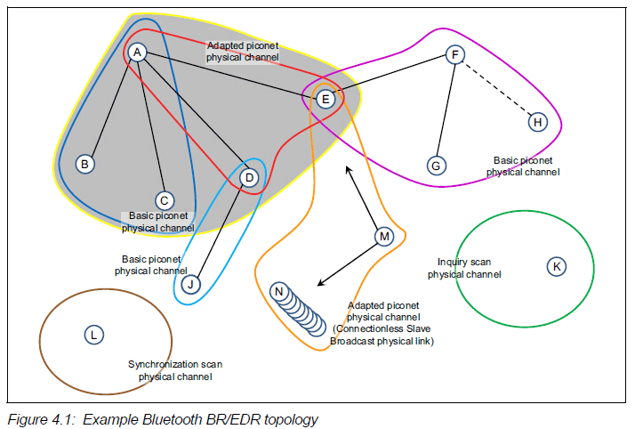
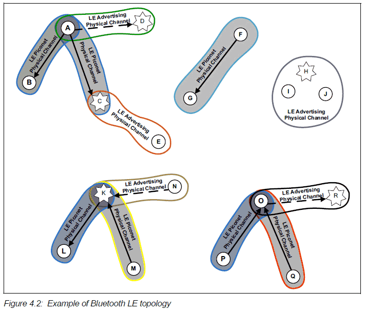

## piconet Topology

### BR/EDR Topology

工作在同一物理信道的2个或更多设备相互连接组成**piconet**。
一个piconet由一个master和多个slave组成。
master提供时钟和跳频模式的参照标准给slaves去同步。

在一个区域里可能有多个piconet，每个piconet使用一个互不相同的物理信道。

一个设备不可以在两个piconet中充当master(如果可以的话，那么这两个piconet将会工作在同一频道上)。
一个设备可以在多个不同的piconet中充当slave角色。

一个设备在一个piconet中，又在另一个piconet中，那么这个设备处于**scatternet**。
蓝牙核心系统没有提供这样的功能，这是由更上层协议实现的。

In Figure 4.1 an example topology is shown that demonstrates a number of the
architectural features described below. Device A is a master in a piconet
(represented by the shaded area, and known as piconet A) with devices B, C,
D and E as slaves. Three other piconets are shown: a) one piconet with device
F as master (known as piconet F) and devices E, G and H as slaves, b) one
piconet with device D as master (known as piconet D) and device J as slave,
and c) one piconet with device M as master (known as piconet M) and device E
as a slave and many devices N as slaves.

In piconet A there are two physical channels. Devices B and C are using the
basic piconet physical channel (represented by the blue enclosure) as they do
not support adaptive frequency hopping. Devices D and E are capable of
supporting adaptive frequency hopping, and are using the adapted piconet
physical channel (represented by the red enclosure). Device A is capable of
adaptive frequency hopping, and operates in a TDM basis on both physical
channels according to which slave is being addressed.

Piconet D and piconet F are both using only a basic piconet physical channel
(represented by the cyan and magenta enclosures respectively). In the case of
piconet D this is because device J does not support the adaptive hopping
mode. Although device D supports adaptive hopping it cannot use it in this
piconet. In piconet F device F does not support adaptive hopping, and
therefore it cannot be used in this piconet.

Piconet M (represented by the orange enclosure) uses a Connectionless Slave
Broadcast physical link over the adaptive piconet physical channel to send
Profile Broadcast Data to many slave devices including E and N.

Piconet M (represented by the orange enclosure) uses a Connectionless Slave
Broadcast physical link over the adaptive piconet physical channel to send
Profile Broadcast Data to many slave devices including E and N.

Device L is shown in the same locality as the other devices. It is not currently a
member of a piconet, but is currently listening on its Synchronization scan
physical channel (represented by the brown enclosure), awaiting a
synchronization train from another device.

### LE Topology

In Figure 4.2 an example topology is shown that demonstrates a number of the
LE architectural features described below. Device A is a master in a piconet
(represented by the shaded area, and known as piconet A) with devices B and
C as slaves. Unlike BR/EDR slaves, LE slaves do not share a common
physical channel with the master. Each slave communicates on a separate
physical channel with the master. One other piconet is shown with device F as
master (known as piconet F) and device G as a slave. Device K is in a
scatternet (known as scatternet K). Device K is master of device L and slave of
device M. Device O is also in a scatternet (known as scatternet O). Device O is
slave of device P and slave of device Q. Note: in the figure, solid arrows point
from master to slave; dashed arrows, indicating a connection initiation, point
from initiator to advertiser using a connectable advertising event; devices that
are advertising are indicated using stars.

There are five other groups of devices shown:
1. Device D is an advertiser and device A is also an initiator (known as group D).  
2. Device E is a scanner and device C is also an advertiser (known as group C).  
3. Device H is an advertiser and devices I and J are scanners (known as group H).  
4. Device K is also an advertiser and device N is an initiator (known as group K).  
5. Device R is an advertiser and device O is also an initiator (known as group R).  

Devices A and B are using one LE piconet physical channel (represented by
the blue enclosure and a dark gray background). Devices A and C are using
another LE piconet physical channel (represented by the blue enclosure and a
lighter gray background). In group D, device D is advertising using a
connectable advertising event on the advertising physical channel
(represented by the green enclosure) and device A is an initiator. Device A can
form a connection with device D and add the device to piconet A. In group C,
device C is also advertising on the advertising physical channel (represented
by the orange enclosure) using any type of advertising events that are being
captured by device E as a scanner. Group D and group C may be using
different advertising PHY channels or different timings to avoid collisions.

In piconet F, there is one physical channel. Devices F and G are using an LE
piconet physical channel (represented by the aqua enclosure). Device F is the
master and device G is the slave.

In group H, there is one physical channel. Devices H, I and J are using an LE
advertising physical channel (represented by the purple enclosure). Device H
is an advertiser and devices I and J are scanners.

In scatternet K, devices K and L are using one LE piconet physical channel.
Devices K and M are using another LE piconet physical channel. In group K,
device K is also advertising using a connectable advertising event on the
advertising physical channel and device N is an initiator. Device N can form a
connection with device K resulting in device K being slave of two devices and
master of one device at the same time.

In scatternet O, devices O and P are using one LE piconet physical channel.
Devices O and Q are using another LE piconet physical channel. In group R,
device R is advertising using a connectable advertising event on the
advertising physical channel and device O is an initiator. Device O can form a
connection with device R resulting in device O being slave of two devices and
master of one device at the same time.
