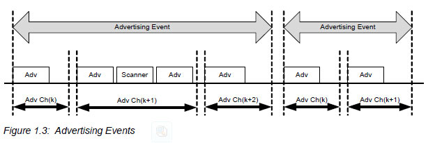

## LE 简介

Like the BR/EDR radio, the LE radio operates in the unlicensed 2.4 GHz ISM band。

LE系统采用跳频收发器来抵抗干扰和衰落，并提供许多FHSS载波。

LE采用两种多址方案:Frequency division multiple access (**FDMA**) and time division multiple access (**TDMA**)
FDMA方案有40个物理信道，每个信道由2MHz隔离。其中3个是广播信道(**advertising channels**)，37个是数据信道(**data channels**)。
TDMA方案，设备在预定时间发送数据包，相应的设备在预定的间隔之后回应数据包。

物理信道(physical channel)被细分为称为事件(**events**)的时间单位。
设备之间把数据包放在事件中传输。
有两种事件：**Advertising and Connection events**。

在广播物理信道(advertising PHY channels)上发送广播包(advertising packets)的设备称为**advertisers**。
在广播信道上接收广播包的设备称**scanners**。

scanner 在收到 advertising packet 后，可以在同一advertising PHY channel上发送请求。
advertiser 使用同一advertising PHY channel回复数据。
在一个advertising event中，Advertiser 将会切换到下一个advertising PHY channel去发送下一个advertising packet。
advertiser 可以在advertising event中的任意时间结束这次event。
在这次advertising event 中使用的第一个advertising PHY channel将会是下一个advertising event的第一个channel。

LE 设备可以使用advertising events 来进行无连接或广播通信(use advertising channels)，也可以使用advertising events 在设备之间建立双向通信(use data channels)。

向另外一个设备发起连接的这个设备，称为发起者(**initiator**)。
advertiser 发出一个可连接的广播事件(connectable advertising event)，initiator 收到这个事件后，可以使用同一个物理信道发出连接请求。
如果advertiser 接收到这个连接请求并同意连接，那么它将结束广播事件，并发起连接事件(connection event)。
当连接建立后，initiator变成**master**，advertiser变成**slave**，它们将形成一个**piconet**。
connection event 用来在master 与 slave 之间传输数据。
在一个connection event 中只会使用一个物理信道。
每一个connection event都是由master 发起，并且它可以在任意时间结束。

piconet中的设备使用特定的跳频模式，其算法由包含在由initiator发送的连接请求中的字段确定。
在LE中使用的跳频模式是ISM频带中的37个频率的伪随机排序。
跳频模式的主要作用就是抗干扰并提高与非跳频ISM系统的并存性能。

LE技术的核心分层是：
* 物理信道(physical channel)
* 物理链路(physical link)
* 逻辑传输(logical transport)
* 逻辑链路(logical link)
* L2CAP信道(L2CAP channel)

基于物理信道(physical channel)，物理链路(**physical link**)在master和slave之间建立。
在一个piconet中slave设备之间是不允许直接通信的。
一个设备在这个piconet中充当slave角色，在另一个piconet中可以是master角色。

物理链路(physical link)被一个或多个支持异步通信的逻辑链路(**logical link**)所使用。

链路层协议，Link Layer protocol(**LL**)。
LL基于逻辑链路(logical links)，用来控制基带层(baseband)和物理层(physical layers)。
piconet中的活跃设备(active devices)有一个默认的LE异步连接逻辑链路(LE asynchronous connection logical transport)，用来传输LL协议信号。
这叫做**LE ACL**。
当一个设备加入piconet后，一个默认的ACL将会被创建。

The Link Layer function 使用LL协议来控制piconet中的设备行为并提供管理底层的服务(PHY and LL)。

LE技术的**L2CAP**层的功能与BR/EDR技术一样。
**L2CAP**，在基带层之上，为应用和服务提供基于通道的抽象(channel-based abstraction)。
它执行应用数据的分割和重组以及通过共享逻辑链路(logical link)对多个信道(channels)的复用和解复用。

基于L2CAP之上，LE 提供两种协议Security Manager protocol (SMP) 和 Attribute protocol (ATT)。
其中ATT也可以被BR/EDR所使用。

