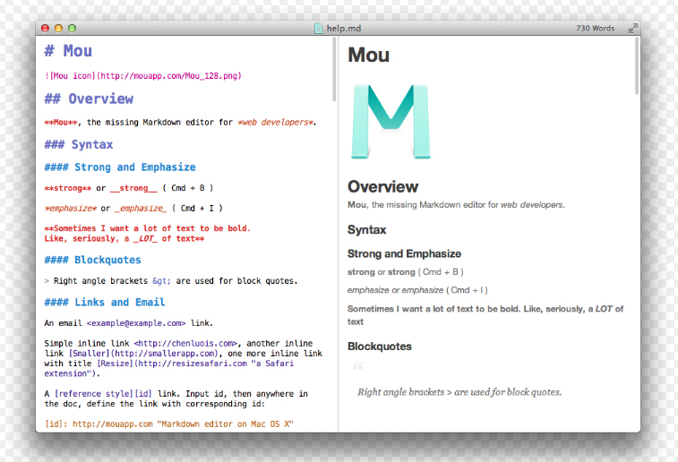

像极客一样写作
====================================

回顾一下我做笔记过程：

一开始使用的是myBase软件，在分类存储管理上做得很好，作为工作笔记使用了一年。
后来发觉这个软件无法在不同的设备间同步数据，或者我没发现这个功能，就果断弃用。

然后就是使用云笔记evernote，它在电脑、移动端都有软件，可以互相同步数据， 网页文章保存、微博收藏等功能都很不错。
但是随着文章数量的增多，evernote越来越无法满足我的两个需求：随时迁移文章到另一个软件；文章格式渲染麻烦，每篇文章都要编辑一次。

然后，我发现了 `markdown + github` 这样的写作方式。

markdown + github
-----------------------------------

这种写作方式有一定的技术门槛。

需要掌握：
* markdown语法
* 版本管理工具：git、SVN等

**markdown** 是一种轻量级标记语言。
它允许人们“使用易读易写的纯文本格式编写文档，然后转换成有效的XHTML(或者HTML)文档”。

markdown语法非常简单，以下是其中一部分：
* 行首插入 1 到 6 个 `#` ，对应到标题 1 到 6 级
* 在每行的最前面加上 `>`，表示区块引用
* 使用星号、加号或是减号作为无序列表标记
* 在一行中用三个以上的星号、减号、底线来建立一个分隔线

markdown转化效果：

不依赖于任何软件，有版本管理，不怕丢失，自己掌握自己的数据。

